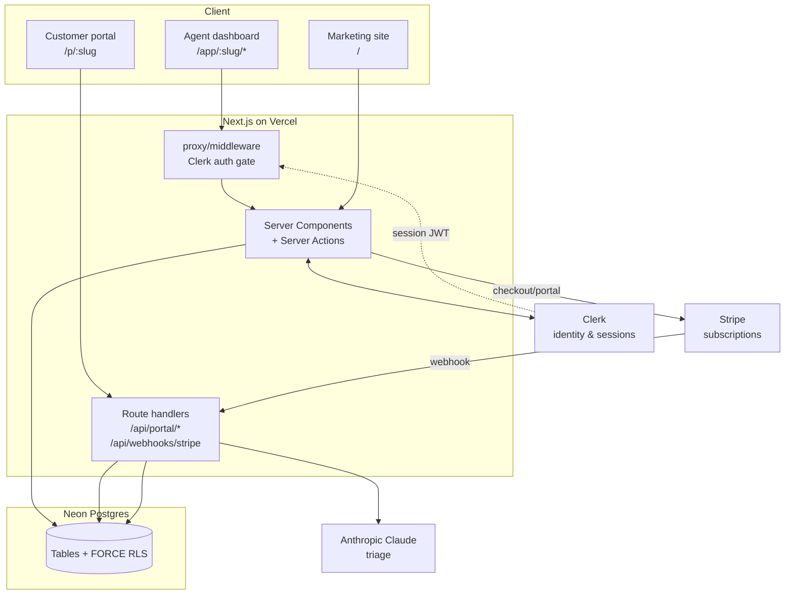
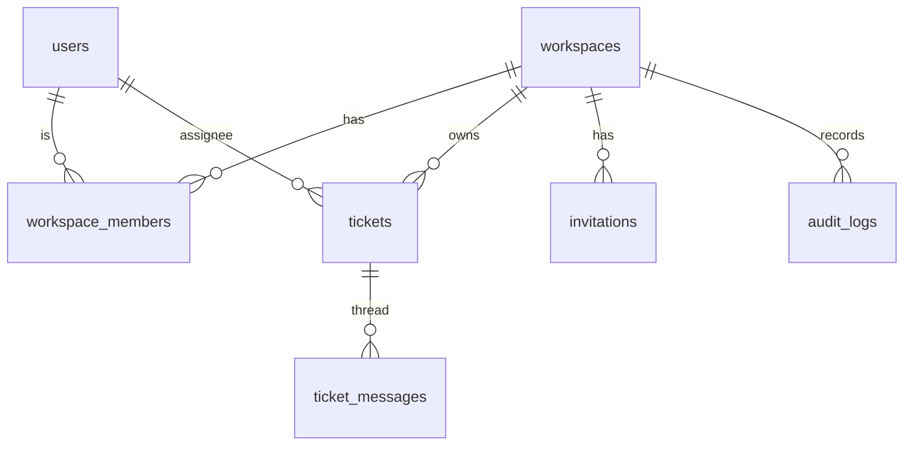

# DeskHive — Architecture

A multi-tenant, AI-assisted help desk. Next.js (App Router) on Vercel, Neon
Postgres via Drizzle, Clerk for identity, Stripe for billing, Claude for triage.

## System overview



## Request authorization & tenant isolation

Identity comes from Clerk; **authorization** comes from our database.

```mermaid
sequenceDiagram
  participant U as Agent
  participant MW as Clerk middleware
  participant S as Server action / RSC
  participant DB as Neon (RLS)
  U->>MW: request /app/acme/inbox (session cookie)
  MW->>MW: auth.protect() — valid session?
  MW->>S: forward with userId
  S->>S: getWorkspaceForUser(userId, slug) + requireRole
  S->>DB: BEGIN; set_config('app.user_id', userId)
  DB-->>S: rows WHERE workspace ∈ user's memberships (RLS)
  S-->>U: scoped data
```

Isolation is **defence-in-depth**:

1. **App layer** — every query is scoped by `workspace_id` and guarded by
   `requireRole`.
2. **Database** — `FORCE ROW LEVEL SECURITY` on `tickets`, `ticket_messages`,
   `workspaces`, `invitations`, `audit_logs`. Policies resolve membership via a
   `SECURITY DEFINER` helper reading `current_setting('app.user_id')`. The app
   connects as `deskhive_app`, a role **without** `BYPASSRLS`, so policies are
   actually enforced (the default `neondb_owner` bypasses RLS and is used only
   for migrations). Verified by `npm run test:rls`.

`withUser(userId, fn)` opens a transaction and pins `app.user_id`; `withSystem`
sets a bypass GUC for legitimately cross-tenant work (Stripe webhooks, AI jobs,
portal submissions before a ticket exists).

## Data model



Infrastructure tables: `rate_limits`, `idempotency_keys`, `processed_events`.

## Key flows

- **Portal submit** → `POST /api/portal/:slug/tickets`: rate limit (IP) →
  validate (+honeypot) → optional idempotency key → `createTicketFromPortal`
  (`withSystem`) → fire-and-forget Claude triage.
- **Agent reply** → server action `replyAction` → `addMessage` sets
  `first_response_at` (stops SLA clock) and transitions `open → pending`,
  bumps `version`, appends an audit entry.
- **Billing** → `upgradeAction` → Stripe Checkout → webhook
  `customer.subscription.*` → `applySubscription` flips plan/seat limit/AI
  (idempotent via `processed_events`).

## Tamper-evident audit log

Each workspace has a SHA-256 hash chain: `hash_n = sha256(prev_hash ||
canonical(entry))`. Appends are serialised with a transaction advisory lock.
`audit_logs` has only SELECT/INSERT policies under FORCE RLS, so rows cannot be
updated or deleted — even by the application role. `verifyChain` recomputes the
chain to detect tampering or deletion.

## PII & data lifecycle

- **PII stored:** authenticated user email/name/avatar (Clerk mirror), ticket
  requester email/name, message bodies.
- **Not stored:** passwords (Clerk), card data (Stripe).
- **In transit/at rest:** TLS everywhere; Neon & Clerk encrypt at rest.
- **Retention/deletion:** workspaces soft-delete (`deleted_at`); user deletion
  cascades memberships. No PII in logs or URLs.

## RTO / RPO / DR

- **RPO ≤ 5 min** via Neon point-in-time recovery; **RTO ≤ 1 h** (restore branch
  + redeploy). Schema changes are version-controlled SQL migrations, replayable
  from zero. Stateless app tier → redeploy is the recovery action.

## Tech decisions

See `docs/adr/` for the reasoning behind multi-tenancy/RLS, the Clerk +
Neon + Next.js stack, and idempotency/rate-limiting.
